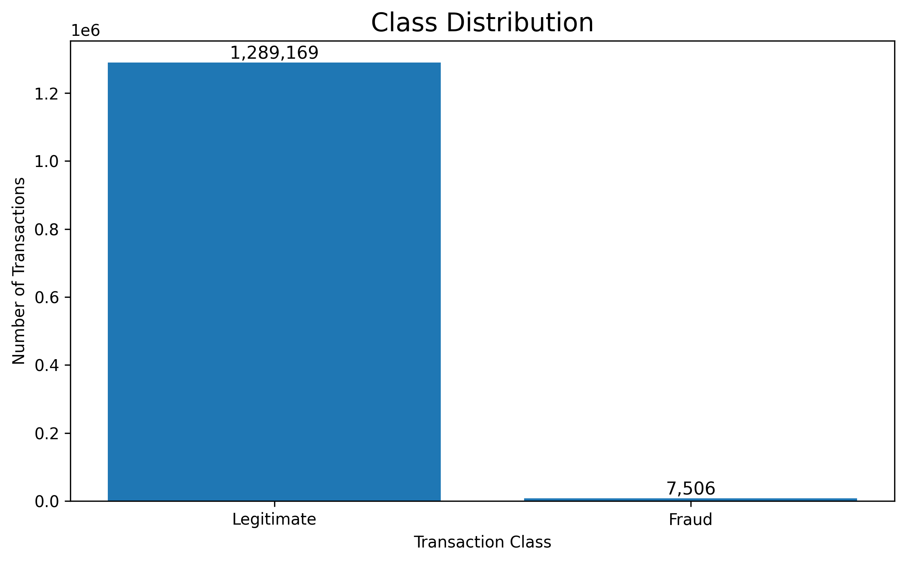
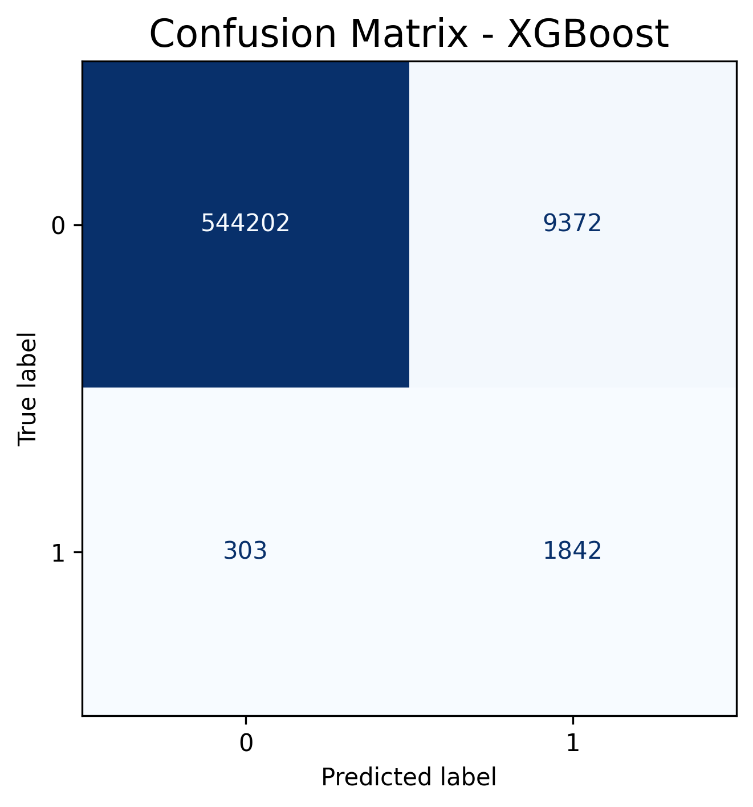
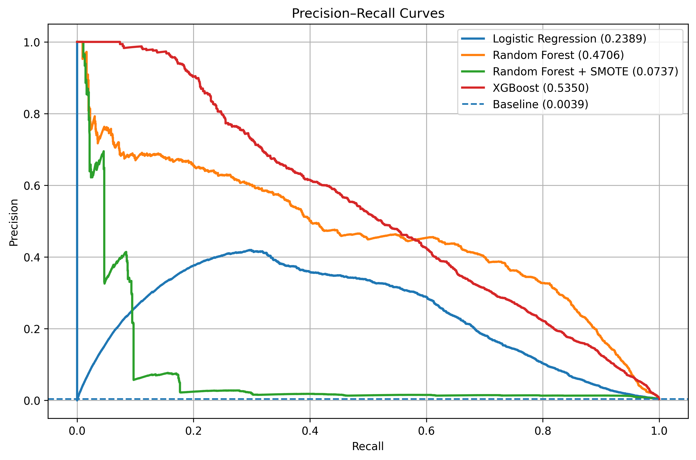
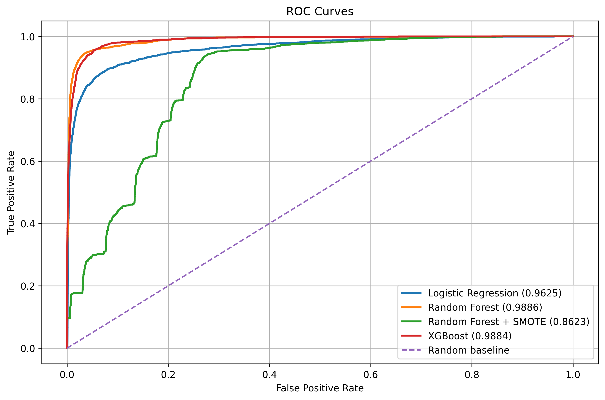
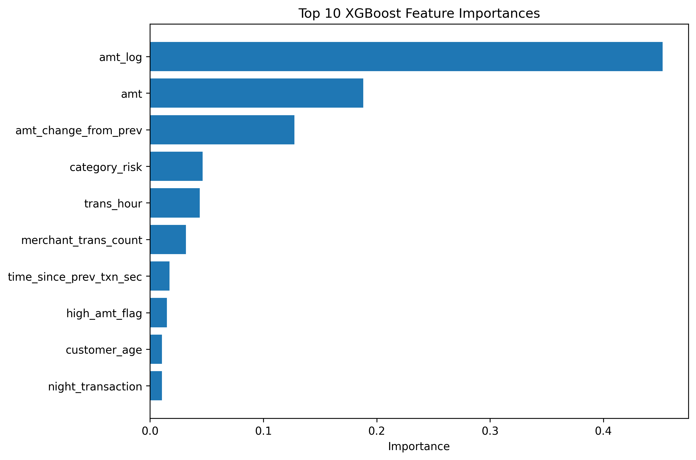

# 💳 Cost-Aware Credit Card Fraud Detection Using Machine Learning

**Author:** Dr. Pooja Shah

An end-to-end machine learning project that detects fraudulent credit card transactions using advanced feature engineering, cost-aware decision making, and interpretable fraud analysis. The project compares multiple machine learning models and evaluates their effectiveness using both traditional classification metrics and business-oriented cost analysis.

---

# 📌 Project Overview

Credit card fraud causes billions of dollars in financial losses every year. Detecting fraudulent transactions is particularly challenging because fraudulent transactions account for only a very small percentage of all transactions.

This project develops a complete fraud detection pipeline that combines data preprocessing, exploratory data analysis, feature engineering, machine learning, threshold optimization, and business-cost evaluation. The objective is to accurately identify fraudulent transactions while minimizing the financial impact of false alarms and missed fraud cases.

---

# 🎯 Objectives

- Detect fraudulent credit card transactions with high recall.
- Compare multiple machine learning algorithms.
- Handle severe class imbalance.
- Engineer behavioral, temporal, geographic, and merchant-based features.
- Evaluate models using statistical metrics and business cost.
- Generate interpretable fraud explanations for flagged transactions.

---

# 📊 Dataset

**Source:** Kaggle Credit Card Fraud Detection Dataset

**Files Used**

- `fraudTrain.csv`
- `fraudTest.csv`

**Problem Type**

Binary Classification

- **0 → Legitimate Transaction**
- **1 → Fraudulent Transaction**

**Dataset Characteristics**

- Highly imbalanced dataset
- Real-world financial transaction records
- Customer, merchant, geographic, and transaction information

---

# 🔄 Project Workflow

```text
Raw Data
    │
    ▼
Data Cleaning
    │
    ▼
Exploratory Data Analysis
    │
    ▼
Feature Engineering
    │
    ▼
Machine Learning Models
    │
    ▼
Model Evaluation
    │
    ▼
Business Cost Analysis
    │
    ▼
Fraud Explanation
```

---

# 🛠 Feature Engineering

Several meaningful features were created to improve fraud detection performance.

### Transaction Features

- Transaction amount
- Log-transformed amount
- High-value transaction flag

### Temporal Features

- Hour of transaction
- Day of week
- Month
- Weekend indicator
- Night transaction indicator

### Customer Features

- Customer age
- Transaction frequency

### Geographic Features

- Home-to-merchant distance
- Distance from previous transaction
- Transaction speed
- Impossible travel detection

### Merchant Features

- Merchant fraud risk
- Category fraud risk
- Merchant transaction count
- Merchant text-based risk score
- Merchant name length
- Merchant word count

### Sequential Features

- Time since previous transaction
- Amount difference from previous transaction

---

# 🤖 Machine Learning Models

The following models were implemented and compared:

- Logistic Regression
- Random Forest
- Random Forest + SMOTE
- XGBoost (Final Selected Model)

---

# 📈 Model Evaluation

The models were evaluated using the following performance metrics:

- Accuracy
- Precision
- Recall
- F1-score
- ROC-AUC
- Precision–Recall AUC
- Confusion Matrix
- Business Cost

---

# ⭐ Project Highlights

- Built an end-to-end fraud detection pipeline.
- Engineered more than 20 predictive features.
- Compared four machine learning models.
- Addressed severe class imbalance using SMOTE.
- Applied cost-aware threshold optimization.
- Implemented rule-based fraud explanations.
- Evaluated models using both predictive performance and business impact.

---

# 💰 Cost-Aware Decision Making

Instead of selecting a model solely based on classification accuracy, this project incorporates business considerations into model evaluation.

The project includes:

- False Positive Cost Analysis
- False Negative Cost Analysis
- Rule-Based Threshold Optimization
- Business Cost Estimation
- BMR-Inspired Dynamic Thresholds

This makes the fraud detection system more suitable for real-world financial applications.

---

## 📊 Results & Visualizations

### Class Distribution

The dataset is highly imbalanced, with only 7,506 fraudulent transactions compared to 1,289,169 legitimate transactions. This imbalance motivates the use of techniques such as SMOTE, threshold optimization, and cost-sensitive evaluation.

<p align="center">
    
</p>

---

### Confusion Matrix

### Confusion Matrix

Illustrates the classification performance of the final XGBoost model, showing the number of correctly and incorrectly classified legitimate and fraudulent transactions.

<p align="center">
  
</p>

---

### Precision–Recall Curve

Compares the precision–recall trade-off across all evaluated models. This metric is especially informative for highly imbalanced fraud detection problems.

<p align="center">
  
</p>

---

### ROC Curve

Shows the Receiver Operating Characteristic (ROC) curves for all evaluated models, illustrating the trade-off between the true positive rate and false positive rate.

<p align="center">
  
</p>

---

### XGBoost Feature Importance

Highlights the ten most influential features used by the final XGBoost model to identify fraudulent transactions.

<p align="center">
  
</p>

---

### 📈  Model Performance Comparison

Compares precision, recall, F1-score, and PR-AUC across the baseline models, ensemble models, and the business-aware amount-tiered XGBoost strategy.

<p align="center">
  
</p>

---

# 💼 Technologies Used

### Programming Language

- Python

### Machine Learning

- Scikit-learn
- XGBoost
- Imbalanced-Learn

### Data Analysis

- Pandas
- NumPy

### Data Visualization

- Matplotlib
- Seaborn

### Development Environment

- Jupyter Notebook
- Google Colab

---

# 📁 Repository Structure

```text
credit-card-fraud-detection/
│
├── README.md
├── requirements.txt
├── .gitignore
│
├── notebooks/
│   └── credit_card_fraud_detection.ipynb
│
├── src/
│   └── credit_card_fraud_detection.py
│
├── images/
│   ├── class_distribution.png
│   ├── confusion_matrix.png
│   ├── precision_recall_curve.png
│   ├── roc_curve.png
│   ├── feature_importance.png
│   └── model_comparison.png
│
├── reports/
│   └── Final_Project_Report.pdf
│
└── data/
    └── README.md
```

---

# 🚀 How to Run

1. Clone the repository.

```bash
git clone https://github.com/DrPoojaShah/credit-card-fraud-detection.git
```

2. Install the required packages.

```bash
pip install -r requirements.txt
```

3. Download the dataset from Kaggle.

4. Place `fraudTrain.csv` and `fraudTest.csv` inside the `data/` folder.

5. Run the notebook located in the `notebooks/` directory.

---

# 🔮 Future Improvements

Potential future enhancements include:

- Real-time fraud detection
- Graph Neural Networks
- Transformer-based fraud detection models
- Explainable AI using SHAP
- Interactive dashboard using Streamlit
- REST API deployment using FastAPI

---

# 👤 Author

**Dr. Pooja Shah**

**GitHub:** https://github.com/DrPoojaShah

---

# 📄 License

This project is intended for educational and research purposes.
